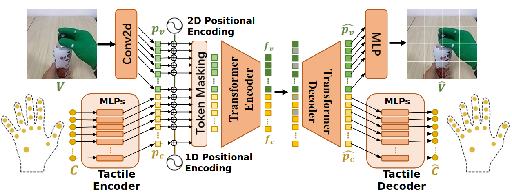

# Pretraining_for_M2VTP

## Table of Contents
- [Introduction](#introduction)
- [Dependencies](#dependencies)
- [Dataset Acquisition](#dataset-acquisition)
- [File Extraction](#file-extraction)
- [Data Preprocessing](#data-preprocessing)
- [Model Pretraining](#model-pretraining)
  - [Pre-trained Model Preparation](#pre-trained-model-preparation)
  - [Pretraining Command](#pretraining-command)
- [License](#license)
- [Contact](#contact)
- [BibTeX](#bibtex)

## Introduction

M2VTP is a pretraining network designed for visual-tactile fusion. The pretrained model can be used for downstream tasks for robotics, such as turning the bottle cap with a robotic hand. For more details, please refer to the paper [Masked Visual-Tactile Pre-training for Robot Manipulation](https://www.researchgate.net/publication/378067504_Masked_Visual-Tactile_Pre-training_for_Robot_Manipulation) and the [paper project](https://lqts.github.io/M2VTP/).



This repository contains the data preprocessing and pretraining code for M2VTP, built on [Voltron](https://github.com/siddk/voltron-robotics).

## Dependencies

The code has been tested on Ubuntu 20.04 with Nvidia GeForce RTX 3090 and CUDA 11.4.

- Create a conda environment and install PyTorch:

```bash
conda create -n m2vtp python==3.8
conda activate m2vtp
pip install torch==2.0.1 torchvision==0.15.2 torchaudio==2.0.2
```

- Install other Python packages:

```bash
pip install -r requirements.txt
```

## Dataset Acquisition

Please download the dataset from the following link:
[Dataset Download Link](https://1drv.ms/u/c/9054151f0ba654c9/EbYX2-fmQ6pDiCf2vF3yYawBLC8lpGQBZWM4L_r3VXBQFw?e=f1swvc)

## File Extraction

After downloading, place the file in the `data/raw/BottleCap` folder and extract the dataset using the following commands:

```bash
mkdir -p data/raw/BottleCap
mv BottleCap.zip data/raw/BottleCap
cd data/raw/BottleCap
unzip BottleCap.zip
```

The directory structure of the `data/raw/BottleCap` folder should be as follows:

```bash
./
├── BottleCap.zip
├── labels
├── tactile
└── videos
```

## Data Preprocessing

The preprocessing script is `pretrain/preprocess.py`. Modify the `PreprocessingConfig` class to set the parameters for data preprocessing. Then run the following command to preprocess the dataset:

```bash
cd Pretraining_for_M2VTP
python pretrain/preprocess.py
```

The preprocessed data will be saved in the `data/processed` folder.

## Model Pretraining

The pretraining script is `pretrain/pretrain.py`. In `pretrain/pretrain_config.py`, modify the `model_dataset` attribute of the `PretrainingConfig` class to set the training models. Detailed parameters of each model can be found in `vitac/conf/models.py`.

### Pre-trained Model Preparation

Our model is trained based on `v-cond`, one of the ViT-Small models provided by [Voltron](https://github.com/siddk/voltron-robotics). You can follow [materialize.py](https://github.com/siddk/voltron-robotics/blob/main/voltron/models/materialize.py) to download the pre-trained model `v-cond+vit-small+sth-sth+epoch-400.pt`. Place the pre-trained model in the `data/model_cache` folder.

### Pretraining Command

Use the following command to run the pretraining script:

```bash
python pretrain/pretrain.py
```


## License

This project is licensed under the MIT License - see the [LICENSE](https://github.com/LQTS/Pretraining_for_M2VTP?tab=MIT-1-ov-file) file for details.

## Contact

If you have any questions or need support, please contact <a href="mailto:l_qingtao@zju.edu.cn"> Qingtao Liu</a> or <a href="mailto:qi.ye@zju.edu.cn">Qi Ye</a>.
.
## BibTeX
```
@inproceedings{liu2024m2vtp,
    title={Masked Visual-Tactile Pre-training for Robot Manipulation},
    author={Liu, Qingtao and Ye, Qi and Sun, Zhengnan and Cui, Yu and Li, Gaofeng and Chen, Jiming},
    booktitle={2024 IEEE International Conference on Robotics and Automation (ICRA)},
    year={2024},
    organization={IEEE}
} 
```
